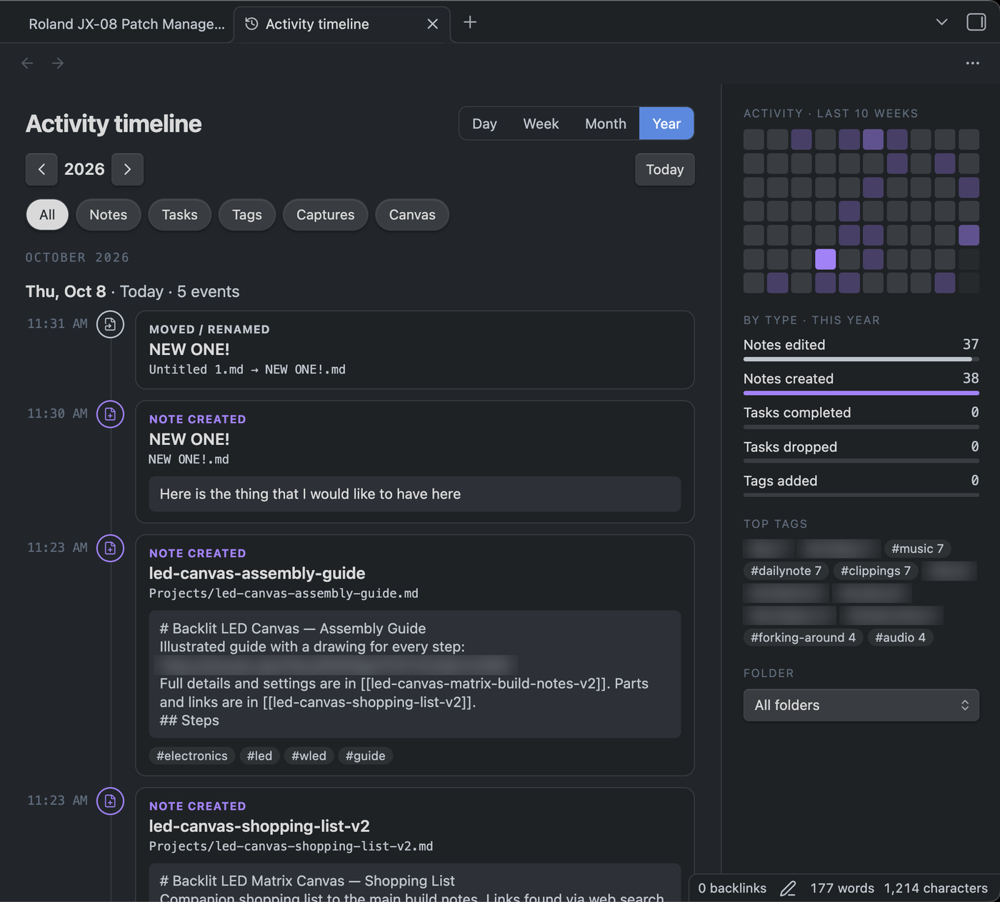

# Activity Timeline for Obsidian

**See what you actually did in your vault on any given day — with previews, not just file names.**

Activity Timeline logs your work as you go and shows it as a scrollable timeline: notes you created, the lines you changed in notes you edited, tasks you completed or dropped, and tags you added. It's built as external memory — a way to answer "what was I working on last Tuesday?" at a glance.

> ⚠️ **Early version (0.1.2).** It works day to day, but expect rough edges. Feedback is very welcome — see [Feature requests & bugs](#feature-requests--bugs).

## Features

- **Timeline** grouped by day, with Day / Week / Month / Year views and arrows to move through time.
- **Edit previews** — each card shows the lines that changed, not just the top of the note. Edits to the same note within 30 minutes are grouped into one card.
- **Tasks plugin support** — ticking a task (`[x]`) logs *Task completed*, cancelling (`[-]`) logs *Task dropped*. Priority, due date and recurring tasks show on the card. Tasks with ✅ / ❌ dates show up on the right day even from **before** you installed the plugin.
- **Tags** — cards show tags added and removed; click any tag to filter, and the sidebar shows your top tags for the period.
- **Sidebar** — 10-week activity heatmap (click a day to jump to it), counts by type, folder filter.
- **Daily-note embed** — add a code block with the language `activity-timeline` (or `day-activity`, if another plugin already uses that name) to a daily note (named like `2026-10-06`) to show that day's activity inside it.
- **Optional capture folders** — if other apps save notes into a folder for you (web clipper, voice transcripts), label them so they show as *Captured*.
- **Choose how far back it looks** — when you first enable it, pick *Only from today*, *Last month*, *Last 6 months*, *Last year* or *Everything*. Change it any time in Settings.
- **Bulk changes stay tidy** — renaming a folder, find-and-replace across the vault or an importer shows as one *Bulk change* card (with the list of notes) instead of hundreds.
- **Built for big, old vaults** — tested on 10,000 notes with two years of logs: views draw in well under a tenth of a second, older history is indexed gently in the background, and log months load only when you look at them.
- Works on **desktop and mobile**. Each device keeps its own log in your vault, so if you sync your vault, every device sees the full history without double-counting synced edits.

## Installation

Not yet in the Community Plugins directory. Two ways to install:

### Option A — BRAT (easiest, gets updates automatically)
1. Install **BRAT** from Settings → Community plugins → Browse.
2. In BRAT's settings choose **Add beta plugin** and paste: `dornbyg/obsidian-activity-timeline`
3. Enable **Activity Timeline** under Settings → Community plugins.

### Option B — Manual
1. Download `main.js`, `manifest.json` and `styles.css` from the [latest release](https://github.com/dornbyg/obsidian-activity-timeline/releases/latest).
2. In your vault, create the folder `.obsidian/plugins/dorn-activity-timeline/` and put the three files in it.
   (The `.obsidian` folder is hidden — on Mac press **Cmd+Shift+.** in Finder to show it.)
3. In Obsidian: Settings → Community plugins → reload the list → enable **Activity Timeline**.

If your vault syncs (iCloud, Obsidian Sync, etc.), the plugin folder syncs too — just enable it on each device.

> **Installed 0.1.0?** Its plugin ID clashed with a different plugin in the Obsidian store, so Obsidian may have replaced it with that one. From 0.1.1 the ID is `dorn-activity-timeline`. Remove the old `activity-timeline` plugin, then reinstall with BRAT or manually. Your history is kept.

## Using it

- Click the **clock icon** in the left ribbon, or run **Open activity timeline** from the command palette. **Show today's activity** jumps straight to today.
- Click a card's title to open the note (task cards open at the task's line).
- Settings: how far back to show history, excluded folders, capture folders, edit-grouping window, preview length, and how long to keep the detailed log.

## Good to know

- **Detailed history starts the day you install.** For earlier days, the plugin can only show when each note was created and its *last* edit (plus Tasks completion/cancel dates). That's a limit of what Obsidian stores, not a setting.
- **Older dates can be unreliable.** Copying or syncing a vault often resets file dates. If a note has a `created` property, that date is used instead. When many notes share the same date, they're shown as one *Imported or copied* entry rather than flooding that day.
- Logs are plain JSON lines in a hidden `.activity-log` folder in your vault (one file per month per device). Nothing leaves your vault.

## Feature requests & bugs

Ideas and bug reports are welcome — please use the [Issues tab](https://github.com/dornbyg/obsidian-activity-timeline/issues/new/choose), which has short forms for both. If someone has already posted your idea, a 👍 on it helps decide what gets built next.

## Credits

**UI design and original idea** by the author of [this r/ObsidianMD post](https://www.reddit.com/r/ObsidianMD/s/lN6dFiUVAC), whose mockup (timeline with type-labelled cards and previews, filter chips, Day/Week/Month/Year toggle, activity heatmap and by-type sidebar) this plugin is built from.

Built and tested by Dorn, adapted to the Tasks plugin and tagging; code written with the help of [Claude](https://claude.ai).

## License

[GPL-3.0](LICENSE) © Dorn
